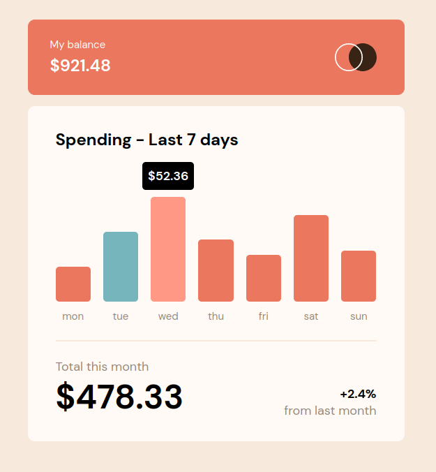

# Frontend Mentor - Expenses chart component solution

This is a solution to the [Expenses chart component challenge on Frontend Mentor](https://www.frontendmentor.io/challenges/expenses-chart-component-e7yJBUdjwt). Frontend Mentor challenges help you improve your coding skills by building realistic projects.

## Table of contents

- [Frontend Mentor - Expenses chart component solution](#frontend-mentor---expenses-chart-component-solution)
  - [Table of contents](#table-of-contents)
  - [Overview](#overview)
    - [The challenge](#the-challenge)
    - [Screenshot](#screenshot)
    - [Links](#links)
  - [My process](#my-process)
    - [Built with](#built-with)
    - [What I learned](#what-i-learned)
  - [Author](#author)

## Overview

### The challenge

Users should be able to:

- View the bar chart and hover over the individual bars to see the correct amounts for each day
- See the current day’s bar highlighted in a different colour to the other bars
- View the optimal layout for the content depending on their device’s screen size
- See hover states for all interactive elements on the page
- **Bonus**: Use the JSON data file provided to dynamically size the bars on the chart

### Screenshot



### Links

- Solution URL: [Frontend Mentor](https://www.frontendmentor.io/solutions/dynamic-graphs-from-a-json-file-with-animated-tooltips-vanilla-js-hkUR9h8XWK)
- Live Site URL: [GitHub Pages](https://seapagan-fem.github.io/expense-chart-component/)

## My process

### Built with

- Semantic HTML5 markup
- CSS custom properties
- Flexbox
- CSS Grid
- Mobile-first workflow
- **Data read from local JSON file**
- Custom tooltips with animations

### What I learned

This was a fun one, with not too many stumbling blocks. I enjoyed creating the
graph dynamically and am quite chuffed with the custom animated tooltips too.

To get the max value of the data, we cant use `Math.max()` directly as it is an
array of objects, so I mapped over the spread of the data :

```javascript
maxSpend = Math.max(...data.map((day) => day.amount));
```

The max bar height was 150px in the Figma file, so I normalized each bar to that
inside a string template :

```javascript
spendBar.style.height = `${Math.round(150 * (amount / maxSpend))}px`;
```

The day highlight is dynamically calculated from the actual current day.

```javascript
const weekday = new Date()
  .toLocaleDateString("default", { weekday: "short" })
  .toLowerCase();
  ```

## Author

- Website - [Grant Ramsay](https://www.gnramsay.com)
- Frontend Mentor - [@seapagan](https://www.frontendmentor.io/profile/seapagan)
- Twitter - [@gnramsay_dev](https://www.twitter.com/gnramsay_dev)
